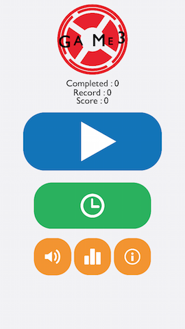
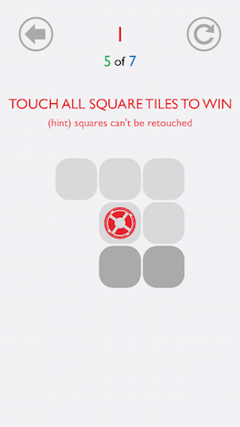
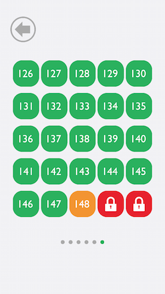
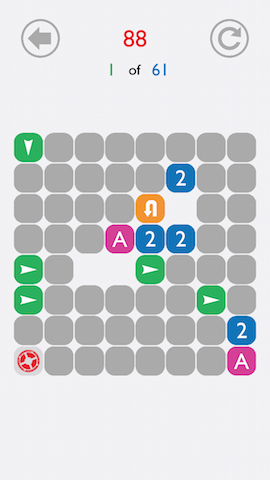
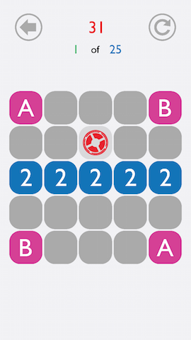

# Game3

This iOS game is written using Swift and SpriteKit.

# How to play

The game is simple:
  - move the red circle around the grid
  - visit every square tile on the grid
  - you can not revisit visited tiles
  - some tiles have special effects

# Screenshots

# License

(c) 2015 Qi Feng Huang. Released under the terms of the MIT license.
